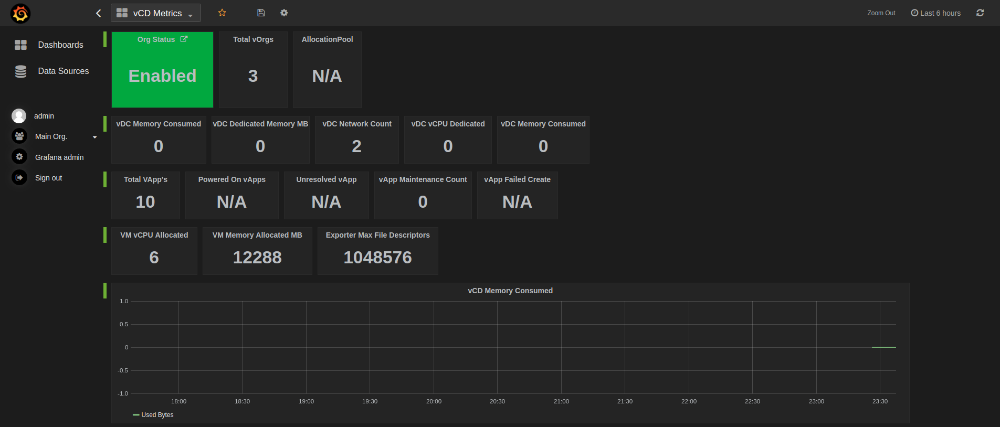

# vcd_exporter

VMware VCD Exporter for Prometheus. 

## Badges

## Grafana Dashboard



## Install

You can do the following to install this exporter:

***Note*** This is only tested working with python3.6

* Install locally

```
$> python setup.py install
$> vcd_exporter -c /path/to/your/config
```

* Install via pip

```
$> python -m pip install vcd-exporter
```

* Run via Docker container

```
docker run -it --rm  -p 9273:9273 -e VCD_USER=${VCD_USERNAME} -e VCD_PASSWORD=${VCD_PASSWORD} -e VCD_IGNORE_SSL=True --name vcd_exporter registry.gitlab.com/frenchtoasters/vcd_exporter:latest -p 9273
```

## Configuration 

You should only provide a configuration file if the environment variables are not going to be set. If you are going to use a configuration file use a volume like so:

```
docker run -it --rm  -p 9273:9273 -v $PWD/vcd_config:/path/to/config --name vcd_exporter registry.gitlab.com/frenchtoasters/vcd_exporter:latest -p 9273 -c /path/to/config
```


The following is what an example `vcd_config.yml` file would look like:

```
default:
    vcd_host: "vcd.host.com"
    vcd_user: "user"
    vcd_password: "password"
    ignore_ssl: False # Inverse of what you want to use atm
```

### Environment Variables

| Variable       | Precedence             | Defaults | Description                                       |
|----------------|------------------------|----------|---------------------------------------------------|
| VCD_HOST       | config, env            | n/a      | Url to vCD instance                               |
| VCD_USER       | config, env            | n/a      | User for connecting to vcd                        |
| VCD_PASSWORD   | config, env            | n/a      | Password for connecting to vcd                    |
| VCD_IGNORE_SSL | config, env            | False    | Ignore the ssl cert on the connection to vcd host |


### Prometheus configuration

The following the base Prometheus configuration file.

```
  # Default config
  - job_name: 'vcd_exporter'
    metrics_path: '/vcd'
    static_configs:
    - targets: ['localhost:9273']
      labels: 
        group: 'vcd-localhost'
  
  # Metrics Config
  - job_name: 'vcd_exporter_metrics'
    static_configs:
    - targets: ['localhost:9273']
      labels: 
        group: 'vcd-gather-metrics'
```

# Example Output

```
$> curl localhost:9273/vcd
# HELP vcd_org_is_enabled {"Description": "Enabled status of Organization", "Enabled": 1, "Disabled": 0}
# TYPE vcd_org_is_enabled gauge
vcd_org_is_enabled{org_full_name="Lobster-Shack",org_name="urn:vcloud:org:0be49a83-0e85-460a-b1b4-9ac84a4de480"} 1.0
vcd_org_is_enabled{org_full_name="backup",org_name="urn:vcloud:org:68b0250e-bddf-4e1c-8cd2-0861e15bb8a1"} 1.0
vcd_org_is_enabled{org_full_name="vcdtest",org_name="urn:vcloud:org:84ceec06-e76d-4d45-83fe-ba9ceeec0497"} 1.0
# HELP vcd_vdc_cpu_allocated CPU allocated to vdc
# TYPE vcd_vdc_cpu_allocated gauge
vcd_vdc_cpu_allocated{allocation_model="AllocationVApp",org_id="urn:vcloud:org:0be49a83-0e85-460a-b1b4-9ac84a4de480",org_name="Lobster-Shack",vdc_id="urn:vcloud:vdc:12aa5168-bd0b-4958-acf8-2b40f706a81c",vdc_is_enabled="True",vdc_name="DR"} 0.0
vcd_vdc_cpu_allocated{allocation_model="AllocationVApp",org_id="urn:vcloud:org:68b0250e-bddf-4e1c-8cd2-0861e15bb8a1",org_name="backup",vdc_id="urn:vcloud:vdc:0793231f-48d0-4e39-bef2-efbeed9027ad",vdc_is_enabled="True",vdc_name="bucket"} 0.0
vcd_vdc_cpu_allocated{allocation_model="AllocationVApp",org_id="urn:vcloud:org:68b0250e-bddf-4e1c-8cd2-0861e15bb8a1",org_name="backup",vdc_id="urn:vcloud:vdc:0a5900ad-f9b8-410f-9be2-f9029e57785a",vdc_is_enabled="True",vdc_name="backup"} 0.0
vcd_vdc_cpu_allocated{allocation_model="AllocationVApp",org_id="urn:vcloud:org:84ceec06-e76d-4d45-83fe-ba9ceeec0497",org_name="vcdtest",vdc_id="urn:vcloud:vdc:d229df09-ba75-48c8-bbd3-bb29946f5c1e",vdc_is_enabled="True",vdc_name="vcdtest"} 0.0
# HELP vcd_vdc_mhz_to_vcpu Mhz to vCPU ratio of vdc
# TYPE vcd_vdc_mhz_to_vcpu gauge
vcd_vdc_mhz_to_vcpu{allocation_model="AllocationVApp",org_id="urn:vcloud:org:0be49a83-0e85-460a-b1b4-9ac84a4de480",org_name="Lobster-Shack",vdc_id="urn:vcloud:vdc:12aa5168-bd0b-4958-acf8-2b40f706a81c",vdc_is_enabled="True",vdc_name="DR"} 1000.0
vcd_vdc_mhz_to_vcpu{allocation_model="AllocationVApp",org_id="urn:vcloud:org:68b0250e-bddf-4e1c-8cd2-0861e15bb8a1",org_name="backup",vdc_id="urn:vcloud:vdc:0793231f-48d0-4e39-bef2-efbeed9027ad",vdc_is_enabled="True",vdc_name="bucket"} 1000.0
vcd_vdc_mhz_to_vcpu{allocation_model="AllocationVApp",org_id="urn:vcloud:org:68b0250e-bddf-4e1c-8cd2-0861e15bb8a1",org_name="backup",vdc_id="urn:vcloud:vdc:0a5900ad-f9b8-410f-9be2-f9029e57785a",vdc_is_enabled="True",vdc_name="backup"} 1000.0
vcd_vdc_mhz_to_vcpu{allocation_model="AllocationVApp",org_id="urn:vcloud:org:84ceec06-e76d-4d45-83fe-ba9ceeec0497",org_name="vcdtest",vdc_id="urn:vcloud:vdc:d229df09-ba75-48c8-bbd3-bb29946f5c1e",vdc_is_enabled="True",vdc_name="vcdtest"} 1000.0
# HELP vcd_vdc_memory_allocated Memory allocated to vdc
# TYPE vcd_vdc_memory_allocated gauge
vcd_vdc_memory_allocated{allocation_model="AllocationVApp",org_id="urn:vcloud:org:0be49a83-0e85-460a-b1b4-9ac84a4de480",org_name="Lobster-Shack",vdc_id="urn:vcloud:vdc:12aa5168-bd0b-4958-acf8-2b40f706a81c",vdc_is_enabled="True",vdc_name="DR"} 0.0
vcd_vdc_memory_allocated{allocation_model="AllocationVApp",org_id="urn:vcloud:org:68b0250e-bddf-4e1c-8cd2-0861e15bb8a1",org_name="backup",vdc_id="urn:vcloud:vdc:0793231f-48d0-4e39-bef2-efbeed9027ad",vdc_is_enabled="True",vdc_name="bucket"} 0.0
vcd_vdc_memory_allocated{allocation_model="AllocationVApp",org_id="urn:vcloud:org:68b0250e-bddf-4e1c-8cd2-0861e15bb8a1",org_name="backup",vdc_id="urn:vcloud:vdc:0a5900ad-f9b8-410f-9be2-f9029e57785a",vdc_is_enabled="True",vdc_name="backup"} 0.0
vcd_vdc_memory_allocated{allocation_model="AllocationVApp",org_id="urn:vcloud:org:84ceec06-e76d-4d45-83fe-ba9ceeec0497",org_name="vcdtest",vdc_id="urn:vcloud:vdc:d229df09-ba75-48c8-bbd3-bb29946f5c1e",vdc_is_enabled="True",vdc_name="vcdtest"} 0.0
# HELP vcd_vdc_memory_used_bytes Memory used by vdc in bytes
# TYPE vcd_vdc_memory_used_bytes gauge
vcd_vdc_memory_used_bytes{allocation_model="AllocationVApp",org_id="urn:vcloud:org:0be49a83-0e85-460a-b1b4-9ac84a4de480",org_name="Lobster-Shack",vdc_id="urn:vcloud:vdc:12aa5168-bd0b-4958-acf8-2b40f706a81c",vdc_is_enabled="True",vdc_name="DR"} 0.0
vcd_vdc_memory_used_bytes{allocation_model="AllocationVApp",org_id="urn:vcloud:org:68b0250e-bddf-4e1c-8cd2-0861e15bb8a1",org_name="backup",vdc_id="urn:vcloud:vdc:0793231f-48d0-4e39-bef2-efbeed9027ad",vdc_is_enabled="True",vdc_name="bucket"} 0.0
vcd_vdc_memory_used_bytes{allocation_model="AllocationVApp",org_id="urn:vcloud:org:68b0250e-bddf-4e1c-8cd2-0861e15bb8a1",org_name="backup",vdc_id="urn:vcloud:vdc:0a5900ad-f9b8-410f-9be2-f9029e57785a",vdc_is_enabled="True",vdc_name="backup"} 0.0
vcd_vdc_memory_used_bytes{allocation_model="AllocationVApp",org_id="urn:vcloud:org:84ceec06-e76d-4d45-83fe-ba9ceeec0497",org_name="vcdtest",vdc_id="urn:vcloud:vdc:d229df09-ba75-48c8-bbd3-bb29946f5c1e",vdc_is_enabled="True",vdc_name="vcdtest"} 0.0
# HELP vcd_vdc_used_network_count Number of networks used by vdc
# TYPE vcd_vdc_used_network_count gauge
vcd_vdc_used_network_count{allocation_model="AllocationVApp",org_id="urn:vcloud:org:0be49a83-0e85-460a-b1b4-9ac84a4de480",org_name="Lobster-Shack",vdc_id="urn:vcloud:vdc:12aa5168-bd0b-4958-acf8-2b40f706a81c",vdc_is_enabled="True",vdc_name="DR"} 2.0
vcd_vdc_used_network_count{allocation_model="AllocationVApp",org_id="urn:vcloud:org:68b0250e-bddf-4e1c-8cd2-0861e15bb8a1",org_name="backup",vdc_id="urn:vcloud:vdc:0793231f-48d0-4e39-bef2-efbeed9027ad",vdc_is_enabled="True",vdc_name="bucket"} 0.0
vcd_vdc_used_network_count{allocation_model="AllocationVApp",org_id="urn:vcloud:org:68b0250e-bddf-4e1c-8cd2-0861e15bb8a1",org_name="backup",vdc_id="urn:vcloud:vdc:0a5900ad-f9b8-410f-9be2-f9029e57785a",vdc_is_enabled="True",vdc_name="backup"} 0.0
vcd_vdc_used_network_count{allocation_model="AllocationVApp",org_id="urn:vcloud:org:84ceec06-e76d-4d45-83fe-ba9ceeec0497",org_name="vcdtest",vdc_id="urn:vcloud:vdc:d229df09-ba75-48c8-bbd3-bb29946f5c1e",vdc_is_enabled="True",vdc_name="vcdtest"} 0.0
# HELP vcd_vdc_vapp_status Status of vApp
# TYPE vcd_vdc_vapp_status gauge
vcd_vdc_vapp_status{org_id="urn:vcloud:org:0be49a83-0e85-460a-b1b4-9ac84a4de480",org_name="Lobster-Shack",vapp_deployed="false",vapp_id="urn:vcloud:vapp:276e345a-3b35-436f-85cb-42242c0421d6",vapp_name="Web",vapp_status="1",vdc_id="urn:vcloud:vdc:12aa5168-bd0b-4958-acf8-2b40f706a81c",vdc_is_enabled="True",vdc_name="DR"} 1.0
vcd_vdc_vapp_status{org_id="urn:vcloud:org:0be49a83-0e85-460a-b1b4-9ac84a4de480",org_name="Lobster-Shack",vapp_deployed="false",vapp_id="urn:vcloud:vapp:ba2291d4-d730-4ea7-8bfe-7edadfa7bb94",vapp_name="App",vapp_status="8",vdc_id="urn:vcloud:vdc:12aa5168-bd0b-4958-acf8-2b40f706a81c",vdc_is_enabled="True",vdc_name="DR"} 8.0
vcd_vdc_vapp_status{org_id="urn:vcloud:org:0be49a83-0e85-460a-b1b4-9ac84a4de480",org_name="Lobster-Shack",vapp_deployed="false",vapp_id="urn:vcloud:vapp:f4a71494-8d93-4588-80d4-fef3f9fdedc5",vapp_name="Cloud Connect 1",vapp_status="1",vdc_id="urn:vcloud:vdc:12aa5168-bd0b-4958-acf8-2b40f706a81c",vdc_is_enabled="True",vdc_name="DR"} 1.0
vcd_vdc_vapp_status{org_id="urn:vcloud:org:68b0250e-bddf-4e1c-8cd2-0861e15bb8a1",org_name="backup",vapp_deployed="false",vapp_id="urn:vcloud:vapp:f7fc154f-331d-442a-ad5d-ddcfc9f23906",vapp_name="windows-backup",vapp_status="8",vdc_id="urn:vcloud:vdc:0a5900ad-f9b8-410f-9be2-f9029e57785a",vdc_is_enabled="True",vdc_name="backup"} 8.0
# HELP vcd_vdc_vapp_in_maintenance Status of maintenance mode of given vApp
# TYPE vcd_vdc_vapp_in_maintenance gauge
vcd_vdc_vapp_in_maintenance{org_id="DR",org_name="urn:vcloud:org:0be49a83-0e85-460a-b1b4-9ac84a4de480",vapp_deployed="false",vapp_id="urn:vcloud:vapp:276e345a-3b35-436f-85cb-42242c0421d6",vapp_name="Web",vdc_id="1",vdc_is_enabled="Lobster-Shack",vdc_name="urn:vcloud:vdc:12aa5168-bd0b-4958-acf8-2b40f706a81c"} 0.0
vcd_vdc_vapp_in_maintenance{org_id="DR",org_name="urn:vcloud:org:0be49a83-0e85-460a-b1b4-9ac84a4de480",vapp_deployed="false",vapp_id="urn:vcloud:vapp:ba2291d4-d730-4ea7-8bfe-7edadfa7bb94",vapp_name="App",vdc_id="8",vdc_is_enabled="Lobster-Shack",vdc_name="urn:vcloud:vdc:12aa5168-bd0b-4958-acf8-2b40f706a81c"} 0.0
vcd_vdc_vapp_in_maintenance{org_id="DR",org_name="urn:vcloud:org:0be49a83-0e85-460a-b1b4-9ac84a4de480",vapp_deployed="false",vapp_id="urn:vcloud:vapp:f4a71494-8d93-4588-80d4-fef3f9fdedc5",vapp_name="Cloud Connect 1",vdc_id="1",vdc_is_enabled="Lobster-Shack",vdc_name="urn:vcloud:vdc:12aa5168-bd0b-4958-acf8-2b40f706a81c"} 0.0
vcd_vdc_vapp_in_maintenance{org_id="backup",org_name="urn:vcloud:org:68b0250e-bddf-4e1c-8cd2-0861e15bb8a1",vapp_deployed="false",vapp_id="urn:vcloud:vapp:f7fc154f-331d-442a-ad5d-ddcfc9f23906",vapp_name="windows-backup",vdc_id="8",vdc_is_enabled="backup",vdc_name="urn:vcloud:vdc:0a5900ad-f9b8-410f-9be2-f9029e57785a"} 0.0
# HELP vcd_vdc_vapp_vm_status Status of VM
# TYPE vcd_vdc_vapp_vm_status gauge
vcd_vdc_vapp_vm_status{org_id="Lobster-Shack",org_name="True",vapp_deployed="urn:vcloud:vdc:12aa5168-bd0b-4958-acf8-2b40f706a81c",vapp_id="App",vapp_name="false",vdc_id="DR",vdc_name="urn:vcloud:org:0be49a83-0e85-460a-b1b4-9ac84a4de480",vm_deployed="false",vm_id="urn:vcloud:vm:393da289-6f35-4d19-82cd-67ba4793ce6e",vm_name="app2.lobstershack.com_replica",vm_os_type="urn:vcloud:vapp:ba2291d4-d730-4ea7-8bfe-7edadfa7bb94",vm_status="8"} 8.0
vcd_vdc_vapp_vm_status{org_id="Lobster-Shack",org_name="True",vapp_deployed="urn:vcloud:vdc:12aa5168-bd0b-4958-acf8-2b40f706a81c",vapp_id="App",vapp_name="false",vdc_id="DR",vdc_name="urn:vcloud:org:0be49a83-0e85-460a-b1b4-9ac84a4de480",vm_deployed="false",vm_id="urn:vcloud:vm:7ae8d5dc-d465-44fd-a60c-0540f28aba45",vm_name="app1.lobstershack.com_replica",vm_os_type="urn:vcloud:vapp:ba2291d4-d730-4ea7-8bfe-7edadfa7bb94",vm_status="8"} 8.0
vcd_vdc_vapp_vm_status{org_id="backup",org_name="True",vapp_deployed="urn:vcloud:vdc:0a5900ad-f9b8-410f-9be2-f9029e57785a",vapp_id="windows-backup",vapp_name="false",vdc_id="backup",vdc_name="urn:vcloud:org:68b0250e-bddf-4e1c-8cd2-0861e15bb8a1",vm_deployed="false",vm_id="urn:vcloud:vm:a280f9d3-b8ca-4912-a6c5-9341530c559c",vm_name="windows-backup",vm_os_type="urn:vcloud:vapp:f7fc154f-331d-442a-ad5d-ddcfc9f23906",vm_status="8"} 8.0
# HELP vcd_vdc_vapp_vm_vcpu vCPU count of vm in given vApp of vdc
# TYPE vcd_vdc_vapp_vm_vcpu gauge
vcd_vdc_vapp_vm_vcpu{org_id="Lobster-Shack",org_name="True",vapp_deployed="urn:vcloud:vdc:12aa5168-bd0b-4958-acf8-2b40f706a81c",vapp_id="App",vapp_name="false",vdc_id="DR",vdc_name="urn:vcloud:org:0be49a83-0e85-460a-b1b4-9ac84a4de480",vm_deployed="false",vm_id="urn:vcloud:vm:393da289-6f35-4d19-82cd-67ba4793ce6e",vm_name="app2.lobstershack.com_replica",vm_os_type="urn:vcloud:vapp:ba2291d4-d730-4ea7-8bfe-7edadfa7bb94",vm_status="8"} 2.0
vcd_vdc_vapp_vm_vcpu{org_id="Lobster-Shack",org_name="True",vapp_deployed="urn:vcloud:vdc:12aa5168-bd0b-4958-acf8-2b40f706a81c",vapp_id="App",vapp_name="false",vdc_id="DR",vdc_name="urn:vcloud:org:0be49a83-0e85-460a-b1b4-9ac84a4de480",vm_deployed="false",vm_id="urn:vcloud:vm:7ae8d5dc-d465-44fd-a60c-0540f28aba45",vm_name="app1.lobstershack.com_replica",vm_os_type="urn:vcloud:vapp:ba2291d4-d730-4ea7-8bfe-7edadfa7bb94",vm_status="8"} 2.0
vcd_vdc_vapp_vm_vcpu{org_id="backup",org_name="True",vapp_deployed="urn:vcloud:vdc:0a5900ad-f9b8-410f-9be2-f9029e57785a",vapp_id="windows-backup",vapp_name="false",vdc_id="backup",vdc_name="urn:vcloud:org:68b0250e-bddf-4e1c-8cd2-0861e15bb8a1",vm_deployed="false",vm_id="urn:vcloud:vm:a280f9d3-b8ca-4912-a6c5-9341530c559c",vm_name="windows-backup",vm_os_type="urn:vcloud:vapp:f7fc154f-331d-442a-ad5d-ddcfc9f23906",vm_status="8"} 2.0
# HELP vcd_vdc_vapp_vm_allocated_memory_mb Memory allocated to VM of given vApp of vdc
# TYPE vcd_vdc_vapp_vm_allocated_memory_mb gauge
vcd_vdc_vapp_vm_allocated_memory_mb{org_id="Lobster-Shack",org_name="True",vapp_deployed="urn:vcloud:vdc:12aa5168-bd0b-4958-acf8-2b40f706a81c",vapp_id="App",vapp_name="false",vdc_id="DR",vdc_name="urn:vcloud:org:0be49a83-0e85-460a-b1b4-9ac84a4de480",vm_deployed="false",vm_id="urn:vcloud:vm:393da289-6f35-4d19-82cd-67ba4793ce6e",vm_name="app2.lobstershack.com_replica",vm_os_type="urn:vcloud:vapp:ba2291d4-d730-4ea7-8bfe-7edadfa7bb94",vm_status="8"} 4096.0
vcd_vdc_vapp_vm_allocated_memory_mb{org_id="Lobster-Shack",org_name="True",vapp_deployed="urn:vcloud:vdc:12aa5168-bd0b-4958-acf8-2b40f706a81c",vapp_id="App",vapp_name="false",vdc_id="DR",vdc_name="urn:vcloud:org:0be49a83-0e85-460a-b1b4-9ac84a4de480",vm_deployed="false",vm_id="urn:vcloud:vm:7ae8d5dc-d465-44fd-a60c-0540f28aba45",vm_name="app1.lobstershack.com_replica",vm_os_type="urn:vcloud:vapp:ba2291d4-d730-4ea7-8bfe-7edadfa7bb94",vm_status="8"} 4096.0
vcd_vdc_vapp_vm_allocated_memory_mb{org_id="backup",org_name="True",vapp_deployed="urn:vcloud:vdc:0a5900ad-f9b8-410f-9be2-f9029e57785a",vapp_id="windows-backup",vapp_name="false",vdc_id="backup",vdc_name="urn:vcloud:org:68b0250e-bddf-4e1c-8cd2-0861e15bb8a1",vm_deployed="false",vm_id="urn:vcloud:vm:a280f9d3-b8ca-4912-a6c5-9341530c559c",vm_name="windows-backup",vm_os_type="urn:vcloud:vapp:f7fc154f-331d-442a-ad5d-ddcfc9f23906",vm_status="8"} 4096.0
```

# References

The vCloud Director exporter uses the following libraries for data collection:

* [pyvcloud](https://github.com/vmware/pyvcloud) for vCD connection
* Prometheus [client_python](https://github.com/prometheus/client_python) for Prometheus metrics
* [Twisted](https://twistedmatrix.com/trac/) for web server

Original code inspired by:

* https://gitlab.com/markypooch
* https://github.com/rverchere/vmware_exporter
* https://gitlab.com/frenchtoasters/vac_exporter
